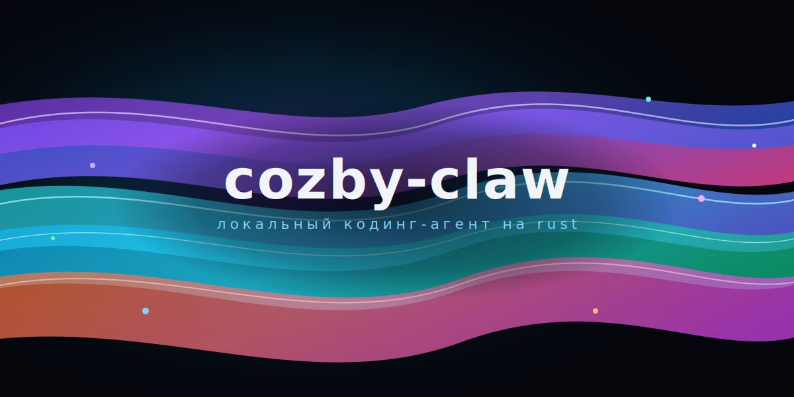

# cozby-claw

<p align="center">
  
</p>

Консольный агент для программирования на чистом Rust — чистый форк, предназначенный для **изолированных (air-gapped) развёртываний с локальными LLM** внутри закрытых корпоративных сетей.

- Единый самодостаточный Rust workspace
- Никакой телеметрии, аналитики, «звонков домой»
- Встроенная поддержка MCP (Model Context Protocol): stdio, SSE, HTTP, WebSocket
- Подменяемый LLM-бэкенд через `ANTHROPIC_BASE_URL` / `OPENAI_BASE_URL` / `XAI_BASE_URL` — направьте на локальный inference-сервер

> [!IMPORTANT]
> Перед развёртыванием в закрытом контуре прочтите [`SECURITY.md`](./SECURITY.md). Там перечислены все исходящие вызовы, которые бинарник способен сделать, и как каждый из них отключить или перенаправить.

## Статус

Экспериментальный. Активная реализация лежит в [`rust/`](./rust). Рабочие сценарии CLI — в [`USAGE.md`](./USAGE.md); детали по крейтам — в [`rust/README.md`](./rust/README.md).

## Быстрый старт

```bash
cd rust
cargo build --workspace
./target/debug/claw --help
```

Указать CLI на локальный inference-сервер с OpenAI-совместимым API (llama.cpp, vLLM, Ollama, TGI и т.п.):

```bash
export OPENAI_BASE_URL="http://127.0.0.1:8080/v1"
export OPENAI_API_KEY="local"   # любое непустое значение
./target/debug/claw --model openai:local-model prompt "привет"
```

Либо на прокси с Anthropic-совместимым API:

```bash
export ANTHROPIC_BASE_URL="http://internal-proxy.local:8443"
export ANTHROPIC_API_KEY="ваш-ключ"
./target/debug/claw prompt "привет"
```

### Кастомная аутентификация

Если провайдер требует не просто `Bearer <key>`, а токен из внешней команды/скрипта
или нестандартные заголовки — задайте это в `~/.claw/providers.toml` (файл вне git,
права 600). Механизм провайдер-агностичный.

Токен из внешнего auth-CLI:

```toml
[primary]
type = "openai"
model = "local-model"
base_url = "http://127.0.0.1:8080/v1"
auth_type    = "command"
auth_command = "my-auth-cli token"   # любой скрипт; его stdout = токен
auth_header  = "Authorization"        # дефолт
auth_format  = "Bearer {token}"       # дефолт; {token} → вывод команды
```

Произвольные заголовки с подстановкой `${env:VAR}` / `${cmd:…}` / `${file:путь}`:

```toml
[primary]
type = "openai"
model = "local-model"
base_url = "http://127.0.0.1:8080/v1"
auth_type = "custom"

[primary.custom_headers]
X-Auth-Token = "${cmd:my-auth-cli token}"
X-Org        = "${env:MY_ORG}"
X-Extra      = "${file:~/.secrets/token}"
```

Вывод `${cmd:…}` кэшируется на `CLAW_AUTH_CMD_TTL_SECS` секунд (дефолт 300).
Полная таблица `auth_type` и примеры — в [CONFIG.md](CONFIG.md) → «Аутентификация».

## MCP (Model Context Protocol)

`cozby-claw` одновременно является **MCP-клиентом** (подключается к внешним MCP-серверам и получает от них инструменты) и поставляется с **бинарным MCP-сервером** (отдаёт ограниченный безопасный набор локальных инструментов любому MCP-совместимому LLM).

### В роли клиента

Зарегистрируйте MCP-серверы в `~/.claw/settings.json` или `<repo>/.claw/settings.json`:

```json
{
  "mcpServers": {
    "my-local-server": {
      "type": "stdio",
      "command": "mcp-server-filesystem",
      "args": ["/путь/к/workspace"]
    },
    "my-internal-http": {
      "type": "http",
      "url": "http://internal-mcp.local:8080/mcp",
      "headers": { "Authorization": "Bearer ..." }
    }
  }
}
```

Поддерживаемые транспорты: `stdio`, `sse`, `http`, `ws`.

### В роли сервера

Бинарь `cozby-mcp` — самостоятельный MCP-сервер по stdio, написанный на чистом Rust. Он предоставляет небольшой безопасный набор инструментов (`read_file`, `list_dir`, `glob`, `grep`), которые ваш локальный LLM может вызывать, ограниченных корнем `--root`.

```bash
cargo build -p cozby-mcp
./target/debug/cozby-mcp --root /путь/к/workspace
```

Подключите его к любому MCP-клиенту (включая сам `cozby-claw`) через stdio-транспорт.

## Структура репозитория

```
rust/                # Rust workspace
  crates/
    api/             # HTTP-провайдеры (Anthropic, OpenAI-compat, xAI)
    commands/        # slash-команды
    compat-harness/  # harness для behaviour-проверок
    mock-anthropic-service/
    plugins/
    runtime/         # сессии, конфигурация, MCP-клиент, мост инструментов
    rusty-claude-cli/# бинарь `claw`
    telemetry/       # локальный JSONL-приёмник событий (наружу ничего не шлёт)
    tools/           # реализации инструментов
    cozby-mcp/       # standalone MCP stdio-сервер (бинарь `cozby-mcp`),
                     # hex-архитектура: domain / application / infrastructure
```

### Архитектура `cozby-mcp` (эталон для новых крейтов)

Стандарт проекта — hexagonal / clean. Пример — крейт `cozby-mcp`:

```
src/
├── domain/              # чистый Rust: errors, limits, path_guard, tools
├── application/
│   ├── ports.rs         # trait FileSystem (+ DirEntry, ReadOutcome)
│   └── use_cases.rs     # read_file / list_dir / glob / grep (pure, тестируются на InMemoryFs)
├── infrastructure/
│   ├── config.rs        # парсер argv
│   ├── fs_adapter.rs    # StdFileSystem над std::fs + walkdir + glob
│   ├── mcp_bridge.rs    # мост к runtime::McpServer (специфика транспорта)
│   └── in_memory_fs.rs  # тест-дубль для application-слоя
├── bootstrap.rs         # wire_server(args, fs) -> McpServer
├── lib.rs               # публичный фасад
└── main.rs              # тонкий entrypoint
```

Направление зависимостей: `infrastructure → application → domain`.
Ractor не использован умышленно: у stdio-сервера нет долгоживущего
mutable state. Когда в будущем понадобится — добавляется только в
`infrastructure/actors/`.

## Проверка

```bash
cd rust
cargo fmt --all --check
cargo clippy --workspace --all-targets -- -D warnings
cargo test --workspace
```

## Лицензия

MIT. См. манифесты крейтов.

## Отказ от ответственности

- Репозиторий **не аффилирован с Anthropic, не одобрен и не сопровождается ею**.
- Он **не** включает, не перепубликует и не претендует на права на какой-либо проприетарный исходный код Claude Code.
